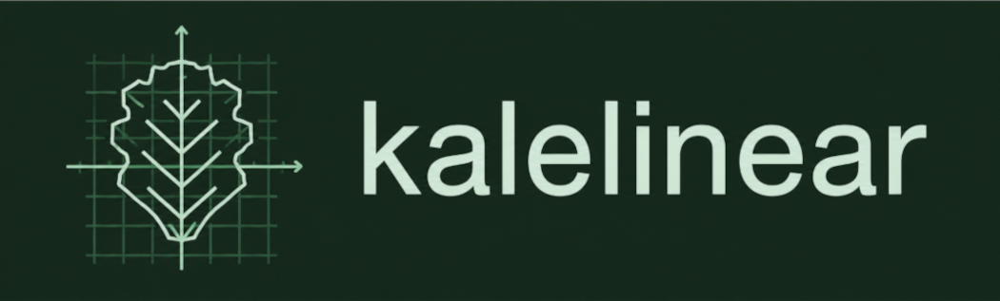

<p align="center">

</p>

# kalelinear

`kalelinear` is a Python library for learning harmonized or individualized models from multi-source/multi-view data in linear or reproducing kernel Hilbert spaces (RKHS). It provides NumPy-based methods for leveraging related data distributions and structural assumptions, including transfer learning, domain adaptation, manifold regularization, and group-aware learning, through a [`scikit-learn`](https://github.com/scikit-learn/scikit-learn) style API.

The package is part of the [PyKale](https://github.com/pykale/pykale) ecosystem and focuses on classical linear and kernel methods that are useful when data are structured by domain labels, covariates, side information, or unlabeled target samples.

## Methods implemented

- Transformer models for learning feature embeddings:
  - Multilinear Principal Component Analysis (MPCA): Lu et al., 2008
    [[IEEE](https://ieeexplore.ieee.org/abstract/document/4359192)]
  - Transfer Component Analysis (TCA): Pan et al., 2009
    [[paper](http://www.aaai.org/ocs/index.php/IJCAI/IJCAI-09/paper/download/294/962)]
  - Joint Distribution Adaptation (JDA): Long et al., 2013
    [[paper](http://openaccess.thecvf.com/content_iccv_2013/papers/Long_Transfer_Feature_Learning_2013_ICCV_paper.pdf)]
  - Balanced Distribution Adaptation (BDA): Wang et al., 2017
    [[paper](http://jd92.wang/assets/files/a08_icdm17.pdf)]
  - Maximum Independence Domain Adaptation (MIDA): Yan et al., 2017
    [[paper](https://ieeexplore.ieee.org/stamp/stamp.jsp?tp=&arnumber=7815350)]
- Estimator models for classification and adaptation:
  - Manifold Regularization Learning Framework (LapSVM, LapRLS): Belkin et al.,
    2006 [[paper](http://www.jmlr.org/papers/v7/belkin06a.html)]
  - Adaptation Regularization Learning Framework (ARSVM, ARRLS): Long et al.,
    2014 [[paper](https://ieeexplore.ieee.org/stamp/stamp.jsp?tp=&arnumber=6550016)]
  - Covariate Independence Regularized Learning Framework (CoIRSVM, CoIRLS):
    Zhou et al., 2020
    [[paper](https://aaai.org/ojs/index.php/AAAI/article/view/6179)],
    Zhou, 2022 [[thesis](https://etheses.whiterose.ac.uk/id/eprint/31044/)]
  - Group-specific Discriminant Analysis (GSDA): Zhou et al., 2025
    [[paper](https://academic.oup.com/gigascience/article/doi/10.1093/gigascience/giaf082/8244707)],
    Zhou, 2022 [[thesis](https://etheses.whiterose.ac.uk/id/eprint/31044/)]
- NumPy-compatible inputs and outputs.
- scikit-learn style `fit`, `transform`, `predict`, `fit_transform`, and
  `fit_predict` workflows where applicable.
- Optional covariate encoding for categorical domain or group labels.

## Installation

Install the released package from PyPI:

```bash
pip install kalelinear
```

Install from a local checkout for development:

```bash
pip install -e ".[dev]"
```

Kale-Linear requires Python 3.10 or later. Core dependencies include:

- [NumPy](http://www.numpy.org/)
- [SciPy](https://www.scipy.org/)
- [scikit-learn](http://scikit-learn.org/)
- [pandas](https://pandas.pydata.org/)
- [tensorly](http://tensorly.org/)
- [cvxopt](http://cvxopt.org/)
- [osqp](https://osqp.org/)

## Quick Start

### Learn a Domain-Invariant Embedding

```python
import numpy as np
from kalelinear.transformer import TCA

X = np.array(
    [
        [-2.0, -1.8],
        [-1.8, -2.1],
        [1.9, 1.7],
        [2.1, 2.0],
        [-1.4, -1.2],
        [-1.2, -1.1],
        [1.2, 1.1],
        [1.4, 1.3],
    ]
)
domain_labels = np.array([0, 0, 0, 0, 1, 1, 1, 1])

transformer = TCA(n_components=2)
z = transformer.fit_transform(X, covariates=domain_labels, target_covariate=1)

z_source = z[domain_labels == 0]
z_target = z[domain_labels == 1]
```

TCA, JDA, and BDA take domain labels through `covariates`. They do not accept
separate source and target arrays; stack samples into one array and use
`target_covariate` to identify the target domain.

### Use MIDA with Categorical Covariates

```python
import numpy as np
from kalelinear.transformer import MIDA

x = np.random.default_rng(0).normal(size=(8, 4))
y = np.array([0, 0, 1, 1, 0, 0, 1, 1])
domains = np.array(["source", "source", "source", "source", "target", "target", "target", "target"])

transformer = MIDA(n_components=2, covariate_encoder="onehot")
z = transformer.fit_transform(x, y=y, covariates=domains)
```

### Train a Domain Adaptation Classifier

For ARSVM and ARRLS, pass all source and target samples in `x`, labels for the
source samples in `y`, and a covariate vector identifying the target domain.

```python
import numpy as np
from kalelinear.estimator import ARSVM

x = np.array(
    [
        [-2.2, -1.9],
        [-1.9, -2.1],
        [1.8, 2.1],
        [2.0, 1.9],
        [-1.4, -1.2],
        [-1.1, -1.3],
        [1.3, 1.1],
        [1.5, 1.2],
    ]
)

source_labels = np.array([0, 0, 1, 1])
domains = np.array([0, 0, 0, 0, 1, 1, 1, 1])
x_target = x[domains == 1]

clf = ARSVM()
clf.fit(x, source_labels, covariates=domains, target_covariate=1)
y_pred = clf.predict(x_target)
```

### Train a Manifold-Regularized Classifier

LapSVM and LapRLS can use labeled source samples together with unlabeled target
samples. The labels array may contain only the labeled source examples.

```python
import numpy as np
from kalelinear.estimator import LapSVM

x_source = np.array([[-2.0, -1.8], [-1.8, -2.1], [1.9, 1.7], [2.1, 2.0]])
ys = np.array([0, 0, 1, 1])
x_target = np.array([[-1.4, -1.2], [-1.2, -1.1], [1.2, 1.1], [1.4, 1.3]])

x_train = np.vstack((x_source, x_target))

clf = LapSVM(kernel="linear")
clf.fit(x_train, ys)
y_pred = clf.predict(x_target)
```

## Public API

```python
from kalelinear.transformer import BDA, JDA, MIDA, MPCA, TCA
from kalelinear.estimator import ARRLS, ARSVM, CoIRLS, CoIRSVM, GSDA, LapRLS, LapSVM
```

## Development

From the root of the repository, run the following commands in your terminal:

1. Install pre-commit hooks (only required once):

   ```bash
   pre-commit install
   ```

2. Run pre-commit checks for code style and formatting on all files:

   ```bash
   pre-commit run --all-files
   ```

3. Run test cases to verify functionality:

   ```bash
   pytest
   ```

4. Build the documentation:

   ```bash
   pip install -r docs/requirements.txt
   sphinx-build -b html docs/source docs/build/html
   ```

## Related Projects

- [POT: Python Optimal Transport](https://github.com/rflamary/POT)
- [Everything about Transfer Learning](https://github.com/jindongwang/transferlearning)
- [ADA: Another Domain Adaptation library](https://github.com/criteo-research/pytorch-ada)
- [Domain Adaptation and Transfer Learning Repositories](https://github.com/domainadaptation)
- [Library of transfer learners and domain-adaptive classifiers](https://github.com/wmkouw/libTLDA)
- [domain-adaptation-toolbox](https://github.com/viggin/domain-adaptation-toolbox)
- [Domain-Adaptations](https://github.com/wihoho/Domain-Adaptations)

## License

Kale-Linear is released under the MIT License. See [LICENSE](LICENSE) for details.
